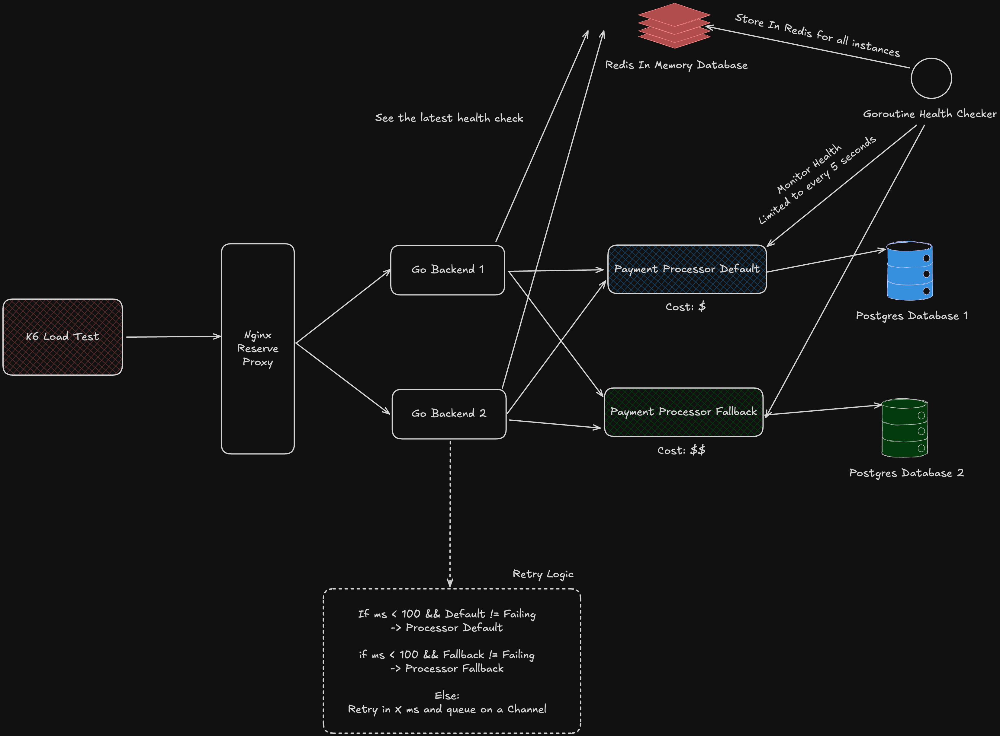

# Rinha de Backend (2025)

Rinha de Backend is a backend development challenge focused on performance, efficiency, and creativity. The 2025 edition has the goal is to create a solution capable of brokering payment requests between clients and two payment processing services (Payment Processors), always seeking the lowest transaction fee and the highest number of processed payments. This has been done in Go.

## About the Challenge

You must develop a backend that receives payment requests and forwards them to two external services: the Payment Processor Default (lower fee) and the Payment Processor Fallback (higher fee, used only when the default is unavailable). The Payment Processor services may experience instabilities, such as slow responses or unavailability (HTTP 5XX). Your solution should be resilient and efficient, always prioritizing the lowest cost.

The Payment Processor source code is available at:  
https://github.com/zanfranceschi/rinha-de-backend-2025-payment-processor

## Challenge Versions

It was created about 6 public released versions with different architectures and strategies to have the highest performance on the challenge, they are:
- https://github.com/davidalecrim1/rinha-with-go-2025/tree/release/redis-fasthttp-extreme-v4
- https://github.com/davidalecrim1/rinha-with-go-2025/tree/release/redis-fasthttp-extreme-v3
- https://github.com/davidalecrim1/rinha-with-go-2025/tree/release/unix-sockets
- https://github.com/davidalecrim1/rinha-with-go-2025/tree/release/redis-default
- https://github.com/davidalecrim1/rinha-with-go-2025/tree/release/mongodb
- https://github.com/davidalecrim1/rinha-with-go-2025/tree/release/redis-fasthttp-nginx

Some use Nginx as a reverse proxy, some use a custom load balancer called Extreme made in Go. Some use Redis as a database, others use MongoDB or in-memory one. Most of them have the network I/O optimized using Unix Domain Sockets. These versions allowed me to reach the top 30 solutions for the competition.

### System Design

This design is for the version of [release/mongodb](https://github.com/davidalecrim1/rinha-with-go-2025/tree/release/mongodb). It was the original version that lead to the optimization of the other ones.
.
